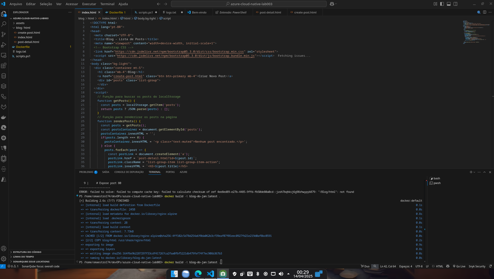
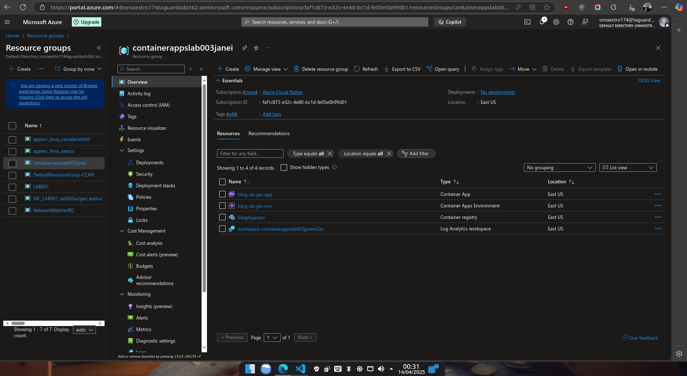
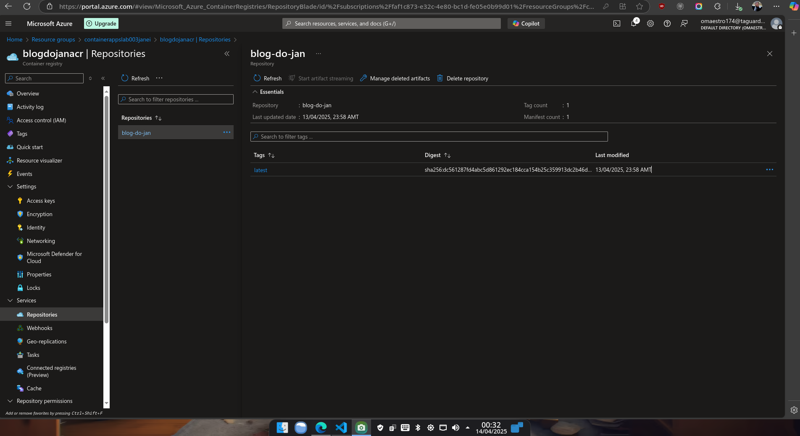
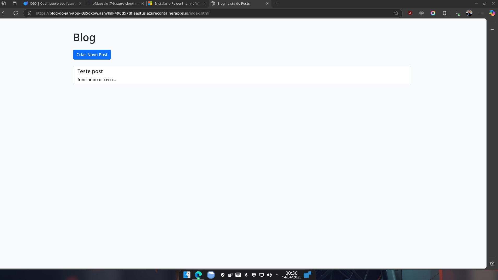
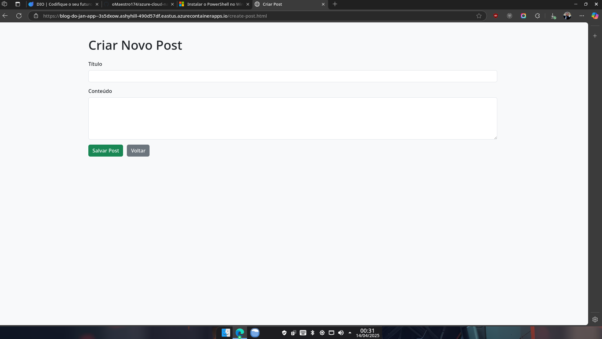
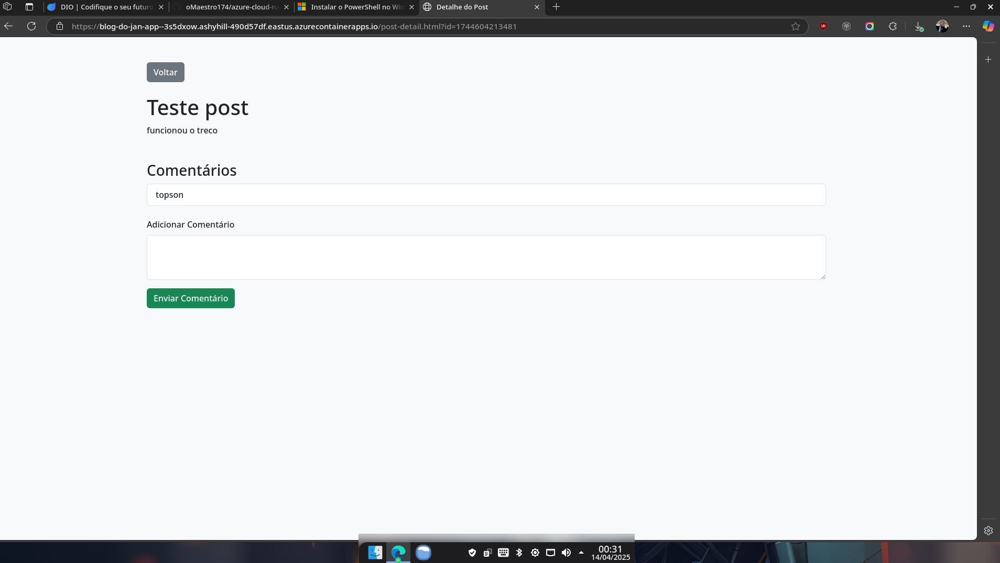

# 🚀 Projeto: Blog do Jan – Deploy em Azure Container Apps

Este projeto tem como objetivo mostrar passo a passo como empacotar uma aplicação web simples em um container Docker e implantá-la no serviço Azure Container Apps, usando Azure CLI. Este documento também registra erros enfrentados e as soluções aplicadas, para auxiliar quem for reproduzir.

---

## 📁 Estrutura do Projeto

```
azure-cloud-native-lab003/
├── blog/
│   └── html/                # Conteúdo estático do blog
├── Dockerfile               # Imagem baseada em nginx
├── scripts.ps1              # Script auxiliar (opcional)
```

---

## 🐳 1. Construção da Imagem Docker

```bash
docker build -t blog-do-jan:latest .
```

---

## 🧪 2. Testando localmente

```bash
docker run -d -p 8089:80 blog-do-jan:latest
```

Acesse: [http://localhost:8089](http://localhost:8089)

---

## ☁️ 3. Autenticando no Azure

```bash
az login
```

---

## 🧱 4. Criando o Resource Group

```bash
az group create --name containerappslab003janei --location eastus
```

---

## 📦 5. Criando o Azure Container Registry (ACR)

### Erro cometido:
```bash
az acr create --resource-group contaianerlab003janei --name blogdojanacr --sku Basic
# ❌ Nome do resource group digitado errado
```

### Correção:
```bash
az acr create --resource-group containerappslab003janei --name blogdojanacr --sku Basic
```

---

## 🔐 6. Login no ACR

### Erros comuns:
```bash
az acr login --name containerappslab003janei
# ❌ Nome incorreto, não corresponde ao nome do ACR
```

### Correto:
```bash
az acr login --name blogdojanacr
```

---

## ☁️ 7. Criando ambiente no Azure Container Apps

```bash
az containerapp env create \
  --name blog-do-jan-env \
  --resource-group containerappslab003janei \
  --location eastus
```

---

## 📤 8. Publicando a imagem no ACR

```bash
docker tag blog-do-jan:latest blogdojanacr.azurecr.io/blog-do-jan:latest
docker push blogdojanacr.azurecr.io/blog-do-jan:latest
```

---

## 🚨 9. Criando o Container App no Azure

### Primeiras tentativas com erros:
- Comando mal digitado (`conatainerapp`, `enviroment`, `resgitry-server`):
```bash
az conatainerapp create ...
az containerapp create --enviroment ...
```

### Comando corrigido:
```bash
az containerapp create \
  --name blog-do-jan-app \
  --resource-group containerappslab003janei \
  --image blogdojanacr.azurecr.io/blog-do-jan:latest \
  --environment blog-do-jan-env \
  --target-port 80 \
  --ingress external \
  --registry-server blogdojanacr.azurecr.io \
  --registry-username blogdojanacr \
  --registry-password <SENHA_GERADA_ACR>
```

> 💡 **Dica:** Gere a senha com:
```bash
az acr credential show --name blogdojanacr
```

---

## 🌐 Acesso à aplicação

A aplicação foi publicada com sucesso e está disponível em:

👉 [https://blog-do-jan-app.ashyhill-490d57df.eastus.azurecontainerapps.io](https://blog-do-jan-app.ashyhill-490d57df.eastus.azurecontainerapps.io)

---

## 🧠 Lições Aprendidas

- Verifique sempre os nomes de recursos (resource group, ACR).
- Utilize comandos com `--help` ao menor sinal de dúvida.
- Erros de digitação em parâmetros causam falhas silenciosas às vezes confusas.
- Use logs para validar se a imagem foi corretamente empurrada para o ACR.

---


## 📝 Logs de Referência
Os logs completos do processo estão disponíveis no arquivo [logs.txt](./logs.txt)


## 📸 Telas da aplicação e procedimentos

### Mão na massa



### Resource Group Pronto


### Container Registry e imagem Prontos


### Aplicação - Tela do Blog


### Aplicação - Tela de Post


### Aplicação - Tela de Comentários


